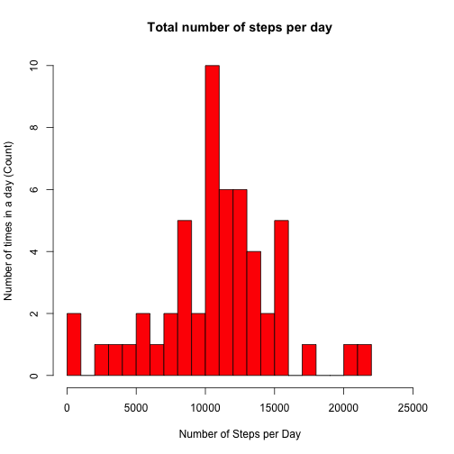
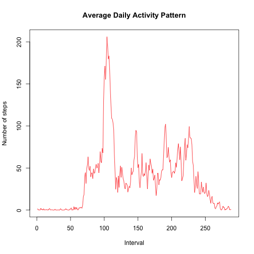
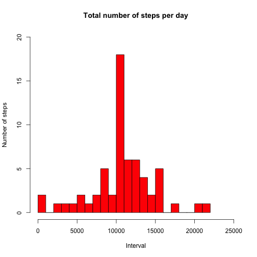
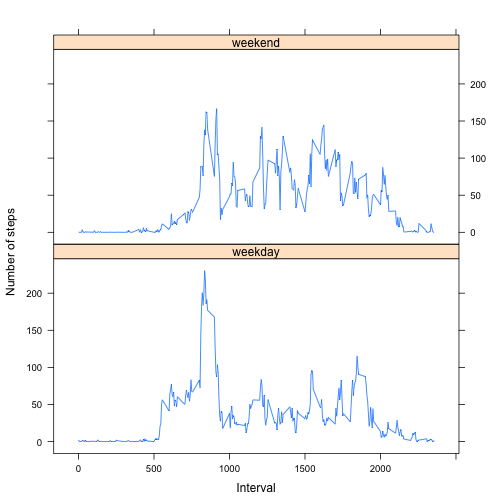

Reproducible Research: Peer assessment 1
----------------------------------------
Author: *Zsuzsanna Sepsey*

Date: *14 March 2015*

Github repository with RMarkdown source code: https://github.com/zsepsey/RepData_PeerAssessment1

### Introduction

This document presents the results of peer assessments 1 of the course Reproducible Research on Coursera. This assignment makes use of data from a personal activity monitoring device. This device collects data at 5 minute intervals through out the day. The data consists of two months of data from an anonymous individual collected during the months of October and November, 2012 and include the number of steps taken in 5 minute intervals each day.

The results are presented in a a single R markdown document that can be processed by knitr and be transformed into an HTML file. Both the questions and the answers ar presented below.

To run the file, execute the following code in the R working directory:


```r
  library(knitr)
  knit2html("Pa1_template.Rmd")
  browseURL("Pa1_template.Html")
```


### Basic Settings


```r
# Load required libraries
library(lattice) 
library(plyr)

 # Always make code visible
echo = TRUE     
```


### Loading and preprocessing the data

**1. Load the data (i.e. read.csv())**


```r
activity <- read.csv("activity.csv",  sep=",", header = TRUE)
```
**2. Process/transform the data (if necessary) into a format suitable for your analysis**


```r
activity[,1] <- as.numeric(activity$steps)
activity[,2] <- as.Date(activity$date, "%Y-%m-%d")
```

The data set looks now like this:

```r
head(activity)
```

```
##   steps       date interval
## 1    NA 2012-10-01        0
## 2    NA 2012-10-01        5
## 3    NA 2012-10-01       10
## 4    NA 2012-10-01       15
## 5    NA 2012-10-01       20
## 6    NA 2012-10-01       25
```
### What is mean total number of steps taken per day?

For this part of the assignment, we can ignore the missing values in the dataset.

**1. Make a histogram of the total number of steps taken each day**


```r
# Calculate the required data
steps_per_day <- ddply(activity, .(date), summarise, Steps=sum(steps))

# plot the data
hist(steps_per_day$Steps,col=c("red"), breaks=20, xlim=c(0, 25000),
     main="Total number of steps per day",
     xlab="Number of Steps per Day", ylab="Number of times in a day (Count)")
```

 

**2. Calculate and report the mean and median total number of steps taken per day**


```r
mean <- mean(steps_per_day$Steps, na.rm=T)
median <- median(steps_per_day$Step, na.rm=T)
```

The mean is **10766.19**, the median is **10765.00**.

### What is the average daily activity pattern?

**1. Make a time series plot (i.e. type = "l") of the 5-minute interval (x-axis) and the average number of steps taken, averaged across all days (y-axis)**


```r
av_steps_per_interval <- ddply(activity, .(interval), summarise, Steps=mean(steps, na.rm=T))
plot.ts(av_steps_per_interval$Steps, col=c("red"), 
        main="Average Daily Activity Pattern", 
        xlab="Interval", ylab="Number of steps")
```

 

**2. Which 5-minute interval, on average across all the days in the dataset, contains the maximum number of steps?**


```r
interval_highest_av_steps <- av_steps_per_interval[av_steps_per_interval$Steps==max(av_steps_per_interval$Steps), ]
```

The maximum average steps is **206.1698113** in interval **835**.

### Imputing missing values

Note that there are a number of days/intervals where there are missing values (coded as NA). The presence of missing days may introduce bias into some calculations or summaries of the data.

**1. Calculate and report the total number of missing values in the dataset (i.e. the total number of rows with NAs)**


```r
num_of_NA <- sum(!complete.cases(activity))
```

The number of missing values is **2304**.

**2. Devise a strategy for filling in all of the missing values in the dataset.**

To populate the missing step values, we use the mean value for the corresponding interval. 


```r
activity_complete <- activity
for (i in 1:nrow(activity)) {
  if (is.na(activity_complete$steps[i])) {
    activity_complete$steps[i] <- 
      av_steps_per_interval[which(activity_complete$interval[i] == av_steps_per_interval$interval), ]$Steps
  }
}
```

The activity data look now like this:

```r
head(activity_complete)
```

```
##       steps       date interval
## 1 1.7169811 2012-10-01        0
## 2 0.3396226 2012-10-01        5
## 3 0.1320755 2012-10-01       10
## 4 0.1509434 2012-10-01       15
## 5 0.0754717 2012-10-01       20
## 6 2.0943396 2012-10-01       25
```

To check if there are no missing values:


```r
sum(!complete.cases(activity_complete))
```

```
## [1] 0
```


**3. Make a histogram of the total number of steps taken each day**


```r
steps_per_day_complete <- ddply(activity_complete, .(date), summarise, Steps=sum(steps))
hist(steps_per_day_complete$Steps,col=c("red"), 
     breaks=20, xlim=c(0, 25000), ylim=c(0,20),
     main="Total number of steps per day",
     xlab="Interval", ylab="Number of steps")  
```

 

**4. Calculate and report the mean and median total number of steps taken per day**


```r
mean_complete <- mean(steps_per_day_complete$Steps)
median_complete <- median(steps_per_day_complete$Step)
```

The mean is **10766.19** and the median is **10766.19**.

**5. Do these values differ from the estimates from the first part of the assignment? What is the impact of imputing missing data on the estimates of the total daily number of steps?**

Before filling in the data, the values were:

- mean: **10766.19** 
- median: **10765.00**

After filling in the data the values became:

- mean: **10766.19**
- median: **10766.19**

We can therefore see that there is a slight difference in the median after filling in the missing values while the mean stayed the same.

**6. What is the impact of imputing missing data on the estimates of the total daily number of steps?**

After filling in the missing vcalues, we can observe a slight change in te median, while the mean stayed the same. The distribution still has the same shape with a higher peek around interval 10000. 

### Are there differences in activity patterns between weekdays and weekends?

**1. Create a new factor variable in the dataset with two levels - "weekday" and "weekend" - indicating whether a given date is a weekday or weekend day.**

We prepare the data by adding a column to activity data set with the factor that indicate week- and weekend days.


```r
activity_complete$weekdays <- factor(weekdays(activity_complete$date))
levels(activity_complete$weekdays) <- list(weekday = c("Monday", "Tuesday",
                                                       "Wednesday", "Thursday", "Friday"),
                                           weekend = c("Saturday", "Sunday"))
```

**2. Make a panel plot containing a time series plot (i.e. type = "l") of the 5-minute interval (x-axis) and the average number of steps taken, averaged across all weekday days or weekend days (y-axis).**


```r
av_steps_per_interval_complete <- ddply(activity_complete, .(interval, weekdays), summarise, 
                                        Steps=mean(steps, na.rm=T))

xyplot(av_steps_per_interval_complete$Steps ~ av_steps_per_interval_complete$interval | 
       av_steps_per_interval_complete$weekdays, 
       layout = c(1, 2), type = "l", 
       xlab = "Interval", ylab = "Number of steps")
```

 

We can see from the plot above that during the weekends activities are more evenly distributed throughout the day, while on weekdays there is a large peek during the morning hours. The latter is probably due to the fact that on weekdays activities are concentrated around working ours. During the weekends is one has more freedom to organize sports activities, hence the more even distribution.
